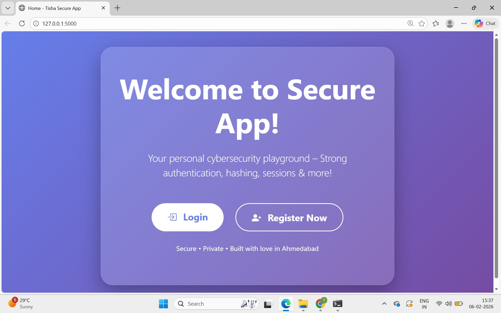
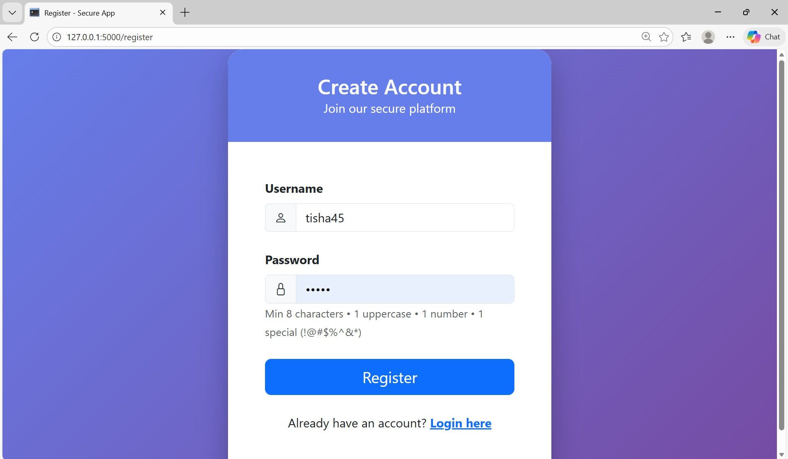
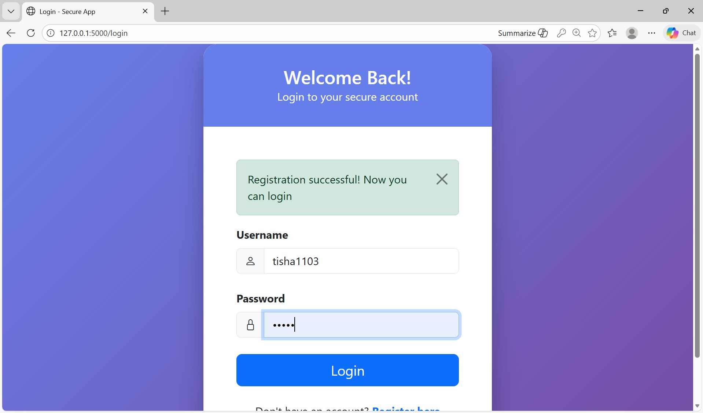
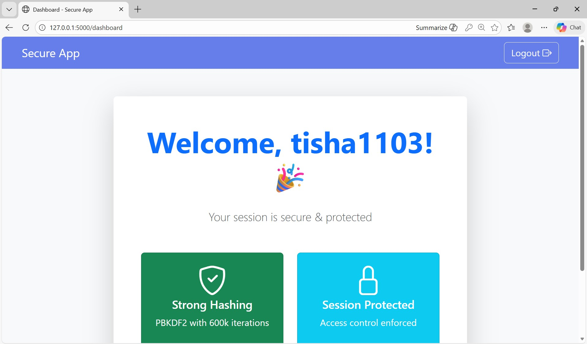

# Cryptonic Area - Project 1  
**Secure Web Application with Authentication & Threat Hardening**

## Project Overview
This is a **secure Flask web application** built as my first internship project. It demonstrates core cybersecurity concepts:

- Strong **authentication & authorization** flow
- **Password hashing** with PBKDF2 (600,000 iterations + salt)
- **Password policy** enforcement (min 8 chars, uppercase, number, special char)
- **Session management** with Flask sessions
- **Access control** (login required for dashboard)
- **Input sanitization** (basic protection from injection attacks)
- Beautiful **Bootstrap 5 UI** with gradient backgrounds & cards

## Features Implemented
- Register with strong password validation
- Login with hashed password verification
- Protected Dashboard page (only logged-in users)
- Logout functionality
- Modern responsive UI (mobile-friendly)

## Tech Stack
- Backend: Python + Flask
- Database: SQLite (users.db)
- Security: Werkzeug (PBKDF2 hashing)
- Frontend: Bootstrap 5 + Bootstrap Icons
- Folder Structure: Project-1 (main project folder)

## How to Run Locally
1. Clone the repo:

git clone https://github.com/tisha2210-dankhara/Cryptonic_area_.git
cd Cryptonic_area_/Project-1

Create & activate virtual environment:
python -m venv venv
venv\Scripts\activate   # Windows
or source venv/bin/activate   # Mac/Linux

Install dependencies:
pip install flask werkzeug

Run the app:
python app.py

Open in browser: http://127.0.0.1:5000

## Screenshots 
- **Home Page**  

- **Register Page**  

- **Login Page**  

- **Dashboard** (after login)  

## Security Highlights
- No plain-text passwords stored
- Strong hashing prevents brute-force attacks
- Session-based access control
- Password policy prevents weak credentials
